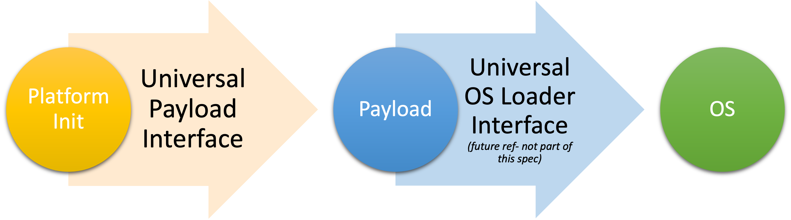

.. SPDX-License-Identifier: CC-BY-4.0

.. _chapter-introduction:

Chapter 1: Introduction
=======================

**Conventions Used in this Document**

The word *shall* or *must* is used to indicate mandatory requirements strictly
to be followed in order to conform to the standard and from which no deviation
is permitted (*shall* or *must* equals *is required to*).

The word *should* is used to indicate that among several possibilities one is
recommended as particularly suitable, without mentioning or excluding others; or
that a certain course of action is preferred but not necessarily required; or
that (in the negative form) a certain course of action is deprecated but not
prohibited (*should* equals *is recommended that*).

The word *may* is used to indicate a course of action permissible within the
limits of the standard (*may* equals *is permitted*).

1.1 Purpose
-----------

Most modern platforms rely on system firmware to initialize the hardware and
launch an image (or commonly described as Operating System, "OS"). The system
firmware is responsible for initializing the platform hardware including CPU and
other silicon functional blocks, detecting and initializing the memory
subsystem, boot media initialization and setting up hardware abstractions for
use by the operating systems.

For this standard, we divide booting into three abstractions, that run in
sequence. The first supports the second, and supplies it with needed tables;
the second supports the third, and will modify the tables, most commonly
extending them. On some systems, such as an ARM SoC, there is code that will
run before the platform initialization. We consider this code to be out of
scope.

Following common practice, we call these abstractions Platform Init, Payload,
and OS. In many cases, these are entirely independent, and their only
dependence is on the tables that are passed from one to the next.

An example of this use, is a Chromebook or cellphone, in which Platform Init
(called, variously, SPL or boot block) enables system memory and power; the
Payload, loaded to system memory, locates and loads an OS; and the OS,
once loaded, takes over the platform.

In some cases, there is only one program, but that program has Platform Init, 
Payload, and OS, called in sequence. The model still works, because the
operations needed are still the same. For example, a Tamago or tinygo program
can start, unfold part of itself into system memory, configure the platform,
and then enter the main() of the program.

For notational convenience, and to avoid mental overload, we take the
traditional view: Platform Init, Payload, and OS are separate, independent
steps, their goal being to get the platform to a working state. Tables are
passed from one step to the next, in memory, with the final consumer being the
OS. We know of no case, from the simplest to the most complex, that can not
be adequately described by this notational convenience. Awareness of the many
variations is important, to avoid bad assumptions; but, awareness having been
gained, we can proceed to think in convenient terms.

It is common for either the Payload or the Platform Init to install persistent
code in hidden memory that is invisible to the OS. We consider this runtime
firmware out of scope.

This specification describes an interface between the Platform Init phase that
initializes the system hardware and the Payload phase. It includes how to format
and pass parameters to the Payload, Payload image format, Payload boot mode and
stack usage, register settings etc. The intent for this specification is to
provide interoperability between spec-compliant Platform Init stage and spec
compliant Payload stage. This can also allow Payloads to be distributed
independently of the board firmware.

1.1.1 Platform Init
~~~~~~~~~~~~~~~~~~~

Platform Init is primarily responsible for initializing the system hardware
including, but not limited to CPU initialization, memory detection and
initialization, initialization of silicon functional units (IO controllers), bus
topology configuration, etc. In addition to the initialization itself, Platform
Init is responsible for providing the system configuration information to the
subsequent stages in the boot process. In addition to proprietary options, there
are several open sourced projects available which provide Platform Init
functionality, For example: EDK-II, coreboot, U-Boot, openSBI, oreboot and Slim
Bootloader.

1.1.2 Payload
~~~~~~~~~~~~~

After initializing the system hardware, Platform Init launches Payload. Payloads
ideally are modular and platform-independent. In order to achieve this
independence, the interfaces used by Platform Init and Payload need to be
described in an abstract way. This document aims to provide a specification for
this abstraction.

While OS boot protocol is one of the main functionality provided by Payloads,
there could be other functionality such as diagnostics that can be enabled by
Payloads.

As mentioned earlier, while certain system-firmware implementations include both
the initialization and OS boot logic in a single code base, the distinction
lies in the functionality provided. This leads to use cases where some system
firmware implementations can act as an Payload providing OS boot capability,
while relying on an underlying Platform Init layer for system-hardware
initialization.

There are many Payloads currently available, including the EDK-II payload, that
provide UEFI services, LinuxBoot, U-Boot, GRUB and other custom implementations.

1.2 Design Goal
---------------

#. Self-describing, in the sense that the names, types, length, and capacity of
   the elements are represented in the data itself, not in an external document
   or metadata.
#. It does not need to be a text format (which might be expensive to parse) but
   should have tools to render it into one
#. Not dependent on any single programming language
#. Allow independent development and deployment of Platform Init and Payload
   meeting compatibility needs
#. Small and simple footprints for fast boots

1.3 Security Requirements
-------------------------

Payload is part of system firmware Trusted Computing Base (TCB).

Today the Payload is provisioned as part of the platform initialization code. As
such, Platform Init should own the signing and verification of Universal Payload
binary as well as other binary (e.g., PXE rom, GOP binary). However, UPL binary
can provide an extra layer of security by having its own signature.
